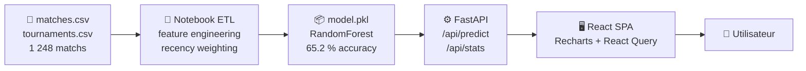
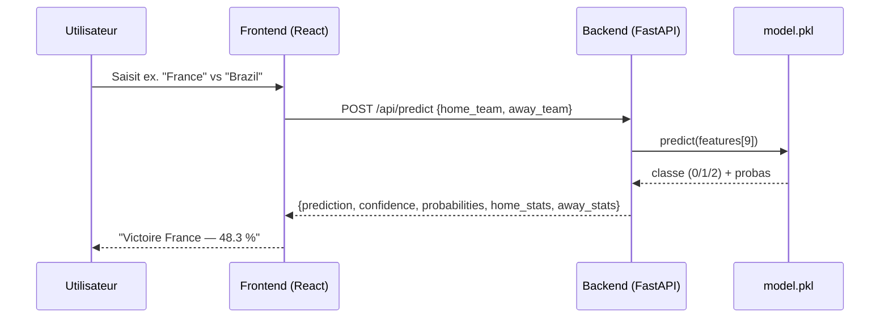

# Dashboard FIFA World Cup 2026 — Prédiction ML

Application full-stack de prédiction de résultats de matchs pour la Coupe du Monde 2026,
entraînée sur l'historique des Coupes du Monde (1930–2022).

🔗 **Demo live** : https://thim1n-wc2026-backend.hf.space

---

## Architecture

### Pipeline de données



### Séquence de prédiction



---

## Stack

| Couche | Technologie |
|--------|-------------|
| Frontend | React 18 + Vite + TypeScript + TanStack React Query + Tailwind CSS + Recharts |
| Backend | FastAPI + joblib + Pydantic v2 |
| ML | scikit-learn RandomForestClassifier |
| Déploiement | Hugging Face Spaces (Docker) |

---

## Modèle ML

- **Données** : 1 248 matchs historiques (Coupes du Monde 1930–2022), fusionnées avec `tournaments.csv`
- **Tâche** : classification 3 classes — `0` victoire domicile · `1` nul · `2` victoire extérieur
- **9 features** par match :

| Feature | Description |
|---------|-------------|
| `home_avg_goals` | Moyenne de buts à domicile (pondérée récence) |
| `away_avg_goals` | Moyenne de buts à l'extérieur (pondérée récence) |
| `goal_diff` | Différence de moyennes de buts |
| `home_total_matches` | Nombre de matchs joués à domicile |
| `away_total_matches` | Nombre de matchs joués à l'extérieur |
| `home_weighted_win_rate` | Taux de victoires domicile (pondéré récence) |
| `away_weighted_win_rate` | Taux de victoires extérieur (pondéré récence) |
| `year` | Année médiane des tournois |
| `count_teams` | Nombre d'équipes médian par tournoi |

- **Pondération récence** : decay exponentiel (half-life 14 ans) — un match 2022 vaut ~2× un match 2008
- **Split** : 80 % train / 20 % test (`random_state=42`)
- **Comparaison modèles** :

| Modèle | Accuracy test set |
|--------|------------------|
| Régression Logistique (baseline) | ~58.8 % |
| **Random Forest** (modèle retenu) | **65.2 %** |

---

## Démarrage local

### Backend (terminal 1)

```bash
cd CodeBase/backend
python -m venv .venv
# Windows :
.venv\Scripts\activate
# macOS/Linux :
source .venv/bin/activate

pip install -r requirements.txt
python main.py        # API sur http://localhost:8000
# Vérif : GET http://localhost:8000/api/health → {"status":"ok","model_loaded":true}
```

### Frontend (terminal 2)

```bash
cd CodeBase/frontend
npm install
npm run dev           # App sur http://localhost:5173
npm run typecheck     # Vérification TypeScript (0 erreurs)
```

### Docker (optionnel)

```bash
cd CodeBase
docker-compose up --build   # backend :8000 + frontend Nginx :80
```

---

## Structure du repo

```
BigData/
├── CodeBase/
│   ├── backend/        # FastAPI · main.py · model.pkl · requirements.txt · Dockerfile
│   ├── frontend/       # React 18 + Vite + TypeScript · src/ · Dockerfile
│   └── etl/            # Jupyter notebook (ETL + entraînement + export model.pkl)
└── Ressources/
    └── Data/           # matches.csv · tournaments.csv (données brutes)
```

---

## Endpoints API

| Méthode | Route | Description |
|---------|-------|-------------|
| `GET` | `/api/health` | Statut du service et chargement du modèle |
| `POST` | `/api/predict` | Prédiction `{home_team, away_team}` → résultat + probas + stats |
| `GET` | `/api/stats` | Top équipes victoires/buts + accuracy du modèle |
