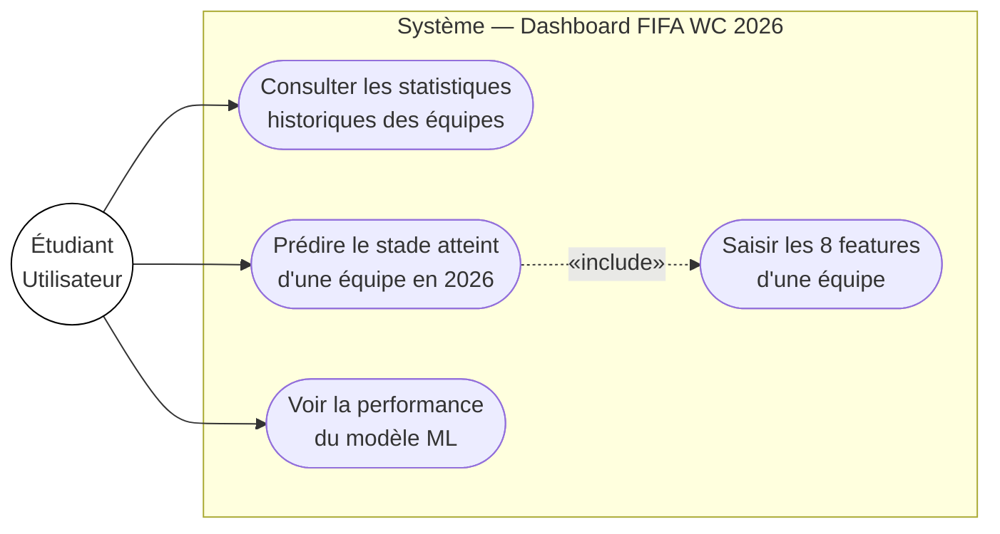

# Spécification Globale — FIFA World Cup 2026 Prediction Dashboard

## Contexte

Projet de cours B3 — introduction aux Big Data. L'objectif pédagogique principal est d'apprendre à **organiser un projet data** de bout en bout, pas seulement à produire du code.

## Question prédictive

> **Quelle est la probabilité qu'une équipe atteigne chaque stade de la Coupe du Monde 2026 ?**

Cible : `stade_atteint` (entier de 1 à 6 : phase de groupes → champion)

## Périmètre fonctionnel

| # | Fonctionnalité | Priorité |
|---|---------------|----------|
| 1 | Pipeline ETL : nettoyer et agréger les matchs 1930–2022 | Haute |
| 2 | Entraîner un modèle ML et l'exporter (`model.pkl`) | Haute |
| 3 | API REST (FastAPI) exposant les prédictions | Haute |
| 4 | Dashboard React affichant stats + prédictions | Haute |
| 5 | Déploiement sur Azure (binaire + app) | Basse (futur) |

## Architecture cible

```
Données brutes (CSV)
      │
      ▼
[ETL Notebook]  ──► features agrégées par équipe/tournoi
      │
      ▼
[Entraînement ML]  ──► model.pkl (exporté via joblib)
      │
      ▼
[Backend FastAPI]  ──► /api/predict  /api/stats  /api/health
      │
      ▼
[Frontend React/Vite]  ──► dashboard interactif
```

## Diagramme de cas d'utilisation (UML)



## Organisation du dépôt

```
BigData/
├── Ressources/
│   ├── 1.intention/   ← "pourquoi"
│   ├── 2.spec/        ← "quoi" (ce dossier)
│   ├── 3.plan/        ← "comment, dans quel ordre"
│   └── Data/          ← CSVs sources
└── CodeBase/
    ├── etl/           ← notebook Jupyter
    ├── backend/       ← FastAPI
    └── frontend/      ← React 18 + Vite + TypeScript
```

## Contraintes techniques

- Python ≥ 3.10 pour le backend
- scikit-learn pour le ML (Random Forest + Gradient Boosting)
- React 18, Vite, TypeScript pour le frontend
- React Query pour tous les appels API (pas de `fetch` nu dans les composants)
- Le modèle est **chargé au démarrage**, jamais ré-entraîné en production
- CORS : backend autorise uniquement `localhost:5173` en dev
