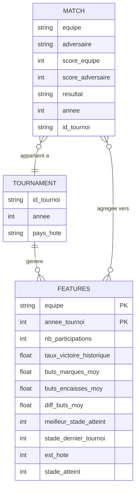
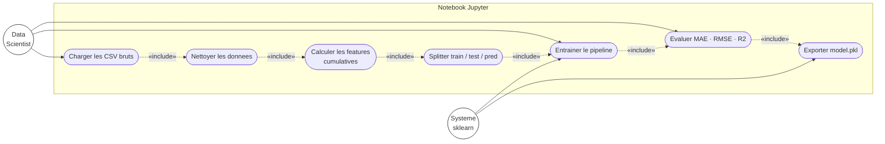

# Spécification — Pipeline ETL

## Sources de données

| Fichier | Lignes | Colonnes clés |
|---------|--------|---------------|
| `matches.csv` | 1 248 | équipe, adversaire, score, tournoi, année |
| `tournaments.csv` | 30 | tournoi, année, pays hôte |

## Objectif

Transformer les matchs bruts en **features agrégées par équipe × tournoi**, prêtes pour l'entraînement ML.

## Features produites (8 features par ligne)

| Feature | Type | Description |
|---------|------|-------------|
| `nb_participations` | int | Nombre de Coupes du Monde disputées jusqu'à ce tournoi |
| `taux_victoire_historique` | float | % de victoires sur toutes les participations passées |
| `buts_marques_moy` | float | Moyenne de buts marqués par match (historique) |
| `buts_encaisses_moy` | float | Moyenne de buts encaissés par match (historique) |
| `diff_buts_moy` | float | `buts_marques_moy − buts_encaisses_moy` |
| `meilleur_stade_atteint` | int | Meilleur stade atteint sur toute l'histoire (1–6) |
| `stade_dernier_tournoi` | int | Stade atteint lors de la Coupe précédente |
| `est_hote` | int (0/1) | 1 si l'équipe est pays hôte du tournoi en cours |

## Target

`stade_atteint` : stade réellement atteint dans ce tournoi (entier 1–6)

## Règle de split temporel

- **Train** : tournois 1930 → 2018 (données passées)
- **Test** : tournoi 2022 Qatar (évaluation hors-échantillon)
- **Prédiction** : tournoi 2026 (USA / Canada / Mexique hôtes → `est_hote = 1`)

**Pourquoi ce split ?** En ML sur données temporelles, on ne doit jamais mélanger passé et futur dans le train/test — c'est du *data leakage*.

## Étapes du notebook (ordre)

1. Charger `matches.csv` et `tournaments.csv`
2. Nettoyer : gérer les valeurs manquantes, normaliser les noms d'équipes
3. Calculer les features par équipe, de façon **cumulée dans le temps** (pas de look-ahead)
4. Joindre avec `tournaments.csv` pour le flag `est_hote`
5. Créer le DataFrame final `(équipe, tournoi) → features + target`
6. Exporter le DataFrame propre (optionnel) et entraîner le modèle
7. `joblib.dump(pipeline, "backend/model.pkl")`

## Bonnes pratiques appliquées

- Le calcul des features est **cumulatif** : pour le tournoi T, on utilise uniquement les données de T−1 et avant (pas de fuite du futur)
- Le pipeline sklearn (`imputer → scaler → model`) garantit que le preprocessing est cohérent entre train et inférence

---

## Diagramme entité-relation (UML ER)

## Diagramme de cas d'utilisation — ETL (UML)

