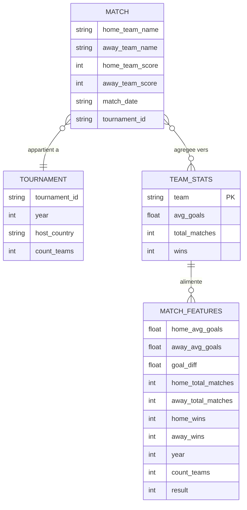
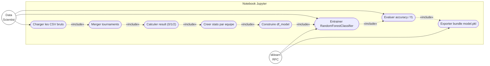

# Spécification — Pipeline ETL

## Sources de données

| Fichier | Lignes | Colonnes clés |
|---------|--------|---------------|
| `matches.csv` | 1 248 | home_team_name, away_team_name, home_team_score, away_team_score, match_date, tournament_id |
| `tournaments.csv` | 30 | tournament_id, year, host_country, count_teams |

## Objectif

Transformer les matchs bruts en **features agrégées par équipe** (statistiques historiques globales), puis construire un dataset match-level pour entraîner un classificateur de résultat de match.

## Étapes du notebook (ordre)

1. Charger `matches.csv` et `tournaments.csv` depuis GitHub
2. Merger `tournaments` sur `tournament_id` pour récupérer `year`, `host_country`, `count_teams`
3. Calculer la cible `result` : 0 = victoire équipe à domicile, 1 = match nul, 2 = victoire équipe à l'extérieur
4. Créer les statistiques globales par équipe (`create_team_features`) :
   - `avg_goals` : moyenne de buts marqués par match
   - `total_matches` : nombre total de matchs joués
   - `wins` : nombre de victoires (résultat == 0 pour home, résultat == 2 pour away)
5. Construire le dataset modèle `df_model` et y ajouter les features home/away
6. Entraîner le `RandomForestClassifier`
7. Exporter le bundle : `joblib.dump(bundle, "backend/model.pkl")`

## Features du modèle (9 features par match)

| Feature | Type | Description |
|---------|------|-------------|
| `home_avg_goals` | float | Moyenne de buts marqués par match par l'équipe à domicile |
| `away_avg_goals` | float | Moyenne de buts marqués par match par l'équipe à l'extérieur |
| `goal_diff` | float | `home_avg_goals − away_avg_goals` |
| `home_total_matches` | int | Nombre total de matchs joués (équipe domicile) |
| `away_total_matches` | int | Nombre total de matchs joués (équipe extérieur) |
| `home_wins` | int | Nombre de victoires (équipe domicile) |
| `away_wins` | int | Nombre de victoires (équipe extérieur) |
| `year` | int | Année du tournoi (médiane utilisée à l'inférence) |
| `count_teams` | int | Nombre d'équipes dans le tournoi (médiane utilisée à l'inférence) |

## Target

`result` : résultat du match

| Valeur | Signification |
|--------|---------------|
| 0 | Victoire équipe à domicile |
| 1 | Match nul |
| 2 | Victoire équipe à l'extérieur |

Distribution : 0 = 677 matchs, 1 = 253, 2 = 318 (sur 1 248 totaux)

## Règle de split

Split aléatoire : `train_test_split(X, y, test_size=0.2, random_state=42)` → 998 train / 250 test.

> Pas de split temporel ici — le modèle prédit le résultat d'un match à partir des stats globales de chaque équipe (pas de look-ahead sur le tournoi).

## Export du bundle

```python
import joblib

bundle = {
    "model": model,
    "home_stats": home_stats,   # dict team_name → {avg_goals, total_matches, wins}
    "away_stats": away_stats,   # même structure pour les stats extérieur
    "median_year": median_year,
    "median_count_teams": median_count_teams,
}
joblib.dump(bundle, "backend/model.pkl")
```

Le backend charge ce bundle une seule fois au démarrage : `bundle = joblib.load("model.pkl")`.

---

## Diagramme entité-relation (UML ER)



## Diagramme de cas d'utilisation — ETL (UML)


