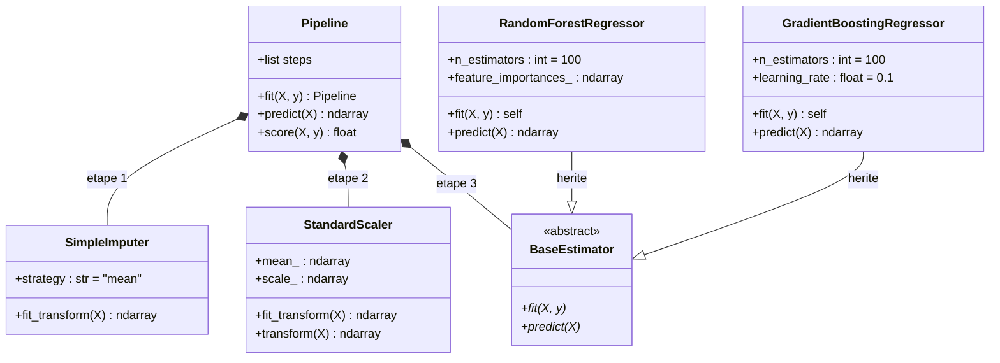
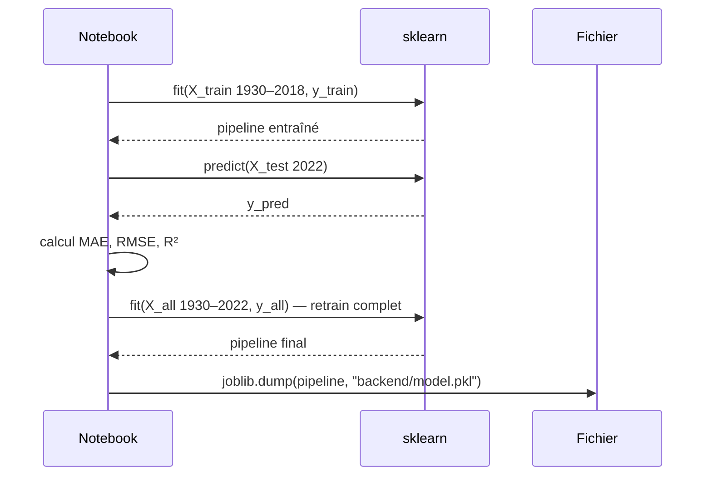

# Spécification — Modèle ML

## Tâche

**Régression** : prédire `stade_atteint` (valeur continue 1.0–6.0) puis arrondir pour obtenir le stade final.

> Pourquoi la régression plutôt que la classification ? Les stades ont un ordre naturel (6 > 5 > 4…), la régression capture mieux cette notion de "meilleur" ou "moins bon" résultat.

## Modèles entraînés

| Modèle | Hyperparamètres par défaut | Avantage |
|--------|--------------------------|----------|
| `RandomForestRegressor` | `n_estimators=100` | Robuste, peu sensible aux outliers |
| `GradientBoostingRegressor` | `n_estimators=100` | Souvent plus précis, apprend sur les erreurs |

Les deux modèles sont encapsulés dans un **pipeline sklearn** :

```
SimpleImputer(strategy='mean')
    → StandardScaler()
        → Model
```

## Métriques d'évaluation

- **MAE** (Mean Absolute Error) : erreur moyenne en nombre de stades
- **RMSE** (Root Mean Squared Error) : pénalise les grosses erreurs
- Évaluer sur le **test set 2022** uniquement

## Export

```python
import joblib
joblib.dump(pipeline, "backend/model.pkl")
```

Le backend charge le fichier une seule fois au démarrage via `joblib.load("model.pkl")`.

## Contrat des features (ordre strict)

Le `predict()` du pipeline attend exactement ces 8 colonnes dans cet ordre :

```python
["nb_participations", "taux_victoire_historique", "buts_marques_moy",
 "buts_encaisses_moy", "diff_buts_moy", "meilleur_stade_atteint",
 "stade_dernier_tournoi", "est_hote"]
```

**Important** : le modèle Pydantic `Features` dans `backend/main.py` doit correspondre exactement. Tout changement d'ordre ou de nom casse la prédiction silencieusement.

## Interprétation du score

| Score prédit | Stade |
|---|---|
| 1 | Phase de groupes |
| 2 | Huitièmes de finale |
| 3 | Quarts de finale |
| 4 | Demi-finales |
| 5 | Finale (2e place) |
| 6 | Champion |

---

## Diagramme de classes UML — Pipeline sklearn



## Cycle train / évaluation / export


