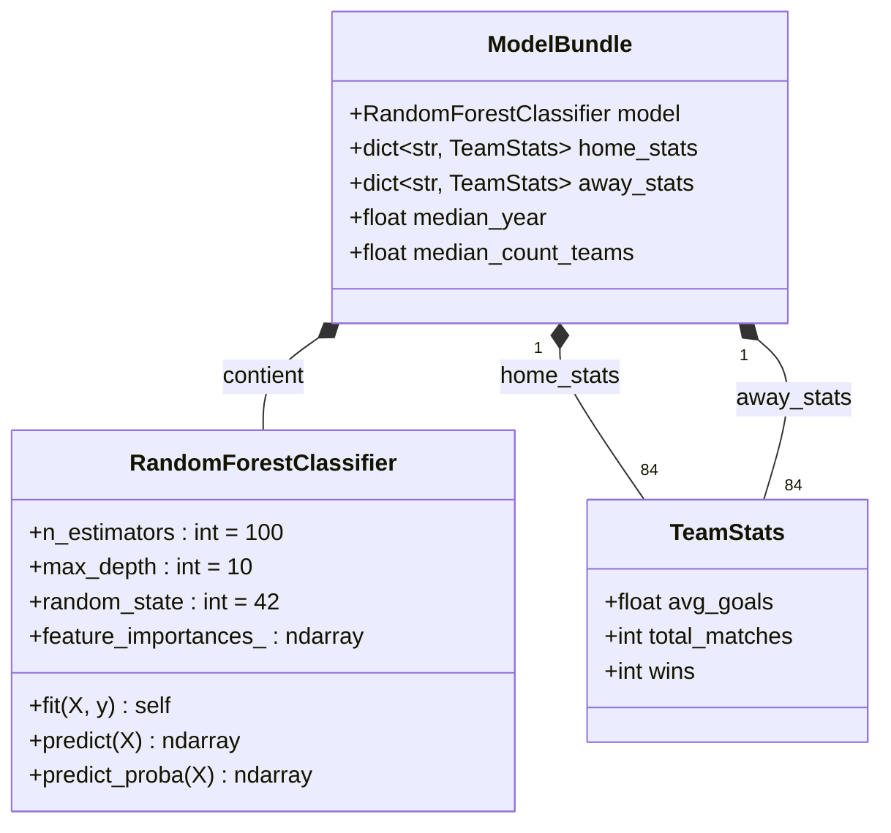
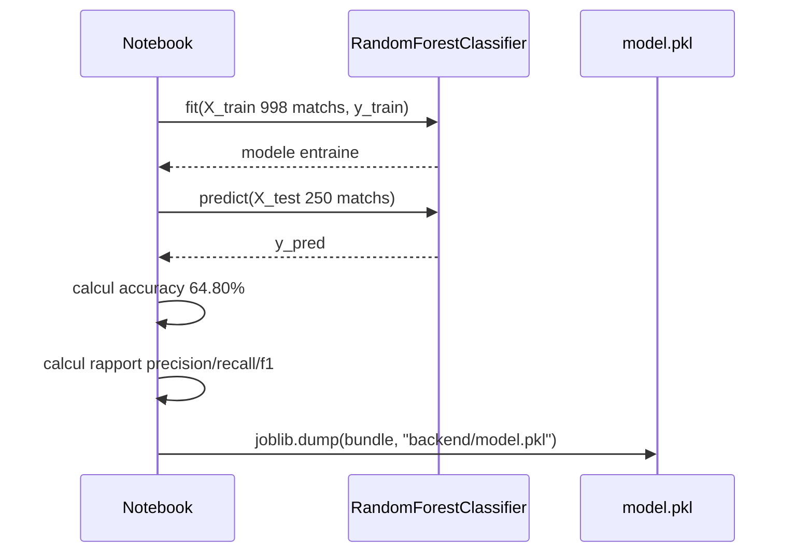

# Spécification — Modèle ML

## Tâche

**Classification multi-classe** : prédire le résultat d'un match (0 = victoire équipe à domicile, 1 = match nul, 2 = victoire équipe à l'extérieur).

> Pourquoi la classification plutôt que la régression ? Les résultats sont discrets et non-ordonnés (un nul n'est pas "entre" une victoire et une défaite dans le sens ML). Le classificateur retourne aussi directement des probabilités par classe, utiles pour l'affichage.

## Modèle entraîné

| Modèle | Hyperparamètres | Avantage |
|--------|----------------|----------|
| `RandomForestClassifier` | `n_estimators=100`, `max_depth=10`, `random_state=42` | Robuste, résistant à l'overfitting, probabilités calibrées |

Le modèle est entraîné **directement** (pas dans un Pipeline sklearn — pas d'imputer ni de scaler) car les features sont déjà des statistiques numériques propres sans valeurs manquantes résiduelles (NaN remplis avec 0).

## Features (ordre strict — 9 colonnes)

```python
features_for_model = [
    'home_avg_goals',
    'away_avg_goals',
    'goal_diff',
    'home_total_matches',
    'away_total_matches',
    'home_wins',
    'away_wins',
    'year',
    'count_teams',
]
```

**Important** : le modèle Pydantic `MatchInput` dans `backend/main.py` ne reçoit que `home_team` et `away_team` (noms d'équipes). La construction du vecteur de features (lookup dans `home_stats`/`away_stats`) se fait côté backend.

## Métriques d'évaluation

| Métrique | Valeur obtenue | Signification |
|----------|---------------|---------------|
| Accuracy | **64.80 %** | 65 % des matchs prédits correctement |
| Precision (macro) | 0.56 | Précision moyenne par classe |
| Recall (macro) | 0.53 | Rappel moyen par classe |
| F1-score (macro) | 0.53 | Compromis précision/rappel |

Détail par classe :

| Classe | Precision | Recall | F1 | Support |
|--------|-----------|--------|----|---------|
| Victoire domicile (0) | 0.70 | 0.83 | 0.76 | 143 |
| Match nul (1) | 0.38 | 0.19 | 0.25 | 47 |
| Victoire extérieur (2) | 0.61 | 0.57 | 0.59 | 60 |

## Export (bundle complet)

```python
import joblib

bundle = {
    "model": model,                          # RandomForestClassifier entraîné
    "home_stats": home_stats,               # dict: team → {avg_goals, total_matches, wins}
    "away_stats": away_stats,               # dict: team → {avg_goals, total_matches, wins}
    "median_year": median_year,             # float — valeur médiane utilisée à l'inférence
    "median_count_teams": median_count_teams, # float — idem
}
joblib.dump(bundle, "backend/model.pkl")
```

Le backend charge le bundle : `bundle = joblib.load("model.pkl")`.

## Interprétation des résultats de prédiction

| Classe prédite | Label affiché | Équipe gagnante |
|---|---|---|
| 0 | "Victoire {home_team}" | Équipe à domicile |
| 1 | "Match Nul" | Aucune |
| 2 | "Victoire {away_team}" | Équipe à l'extérieur |

La réponse inclut aussi les probabilités pour chaque classe (`predict_proba`), permettant d'afficher la confiance du modèle.

## Équipes disponibles (84 équipes connues)

Le dictionnaire `home_stats` contient 84 équipes issues des données historiques 1930–2022. Pour une équipe inconnue, les stats sont ramenées à 0 (comportement de la fonction `predict_match` du notebook).

---

## Diagramme de classes UML — Modèle



## Cycle train / évaluation / export


