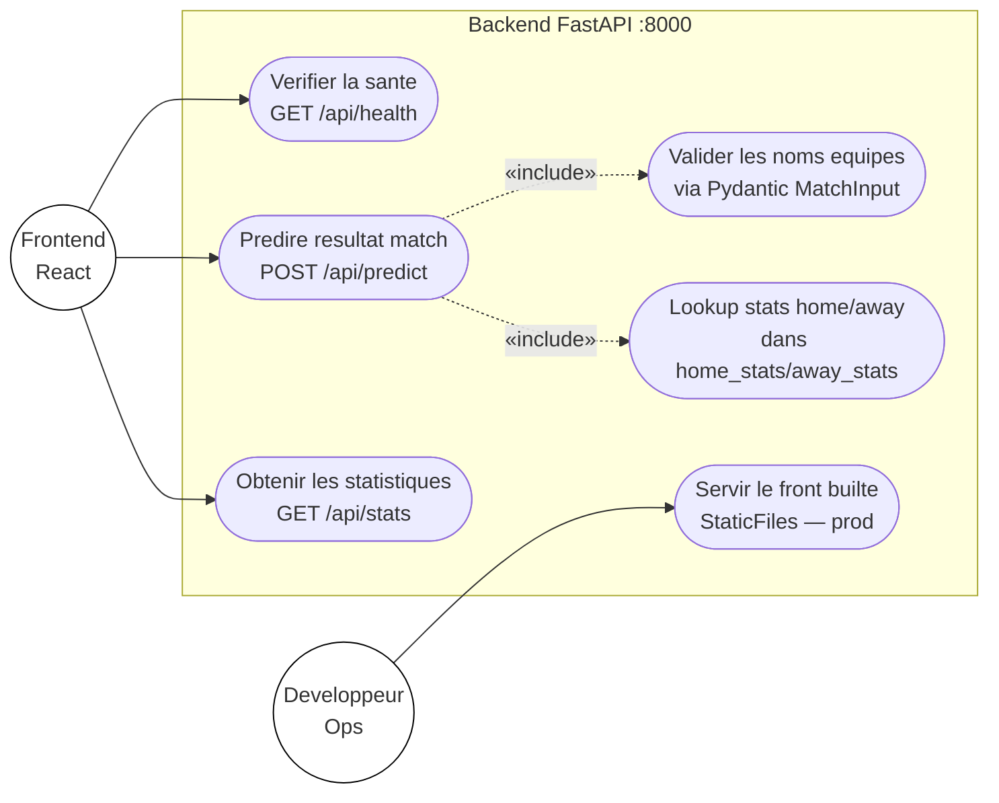
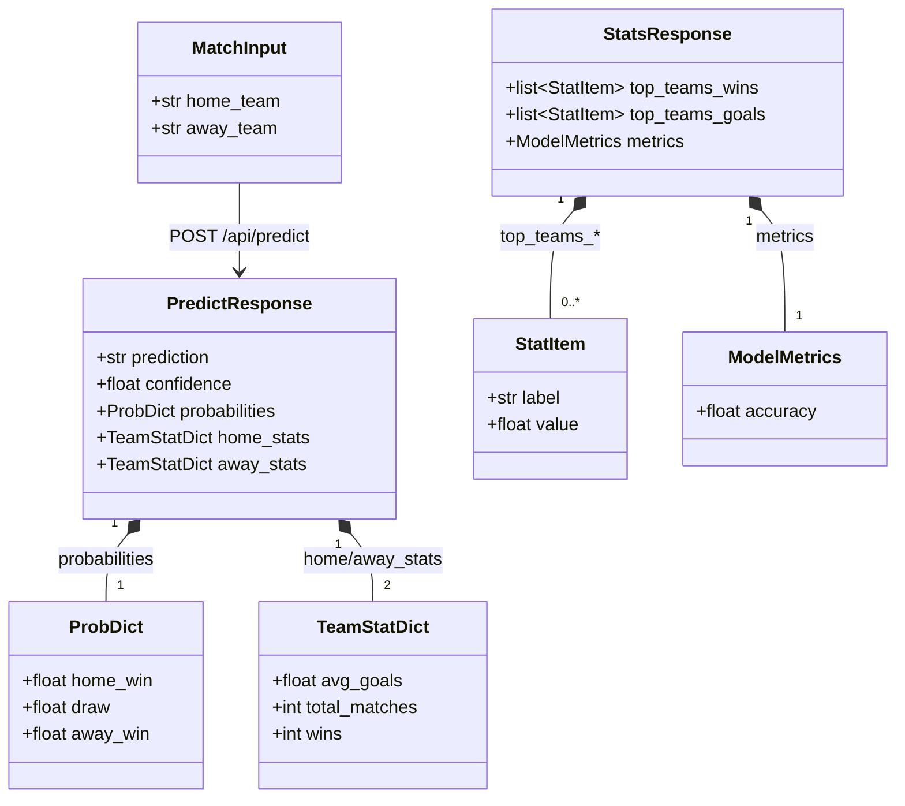
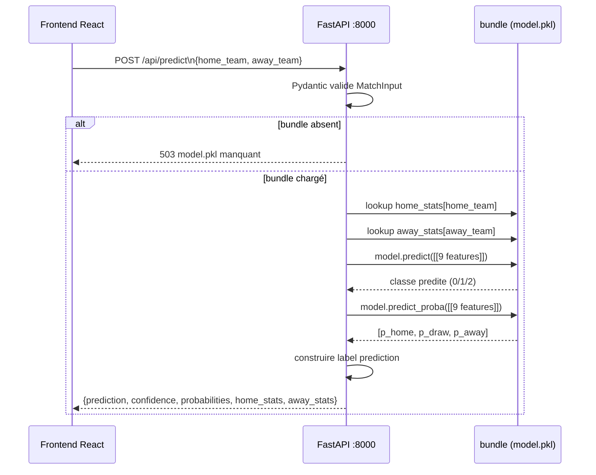

# Spécification — Backend FastAPI

## Responsabilités

- Charger le bundle `model.pkl` au démarrage (une seule fois) : modèle RFC + dicts de stats + médians
- Exposer les endpoints REST consommés par le frontend
- Servir les fichiers statiques du frontend en production

## Endpoints

### `GET /api/health`
Vérification que l'API est opérationnelle.

**Réponse** :
```json
{ "status": "ok", "model_loaded": true }
```

---

### `POST /api/predict`
Prédit le résultat d'un match entre deux équipes.

**Corps de la requête** (Pydantic `MatchInput`) :
```json
{
  "home_team": "France",
  "away_team": "Mexico"
}
```

**Réponse** :
```json
{
  "prediction": "Victoire France",
  "confidence": 0.4829,
  "probabilities": {
    "home_win": 0.4829,
    "draw": 0.3160,
    "away_win": 0.2012
  },
  "home_stats": {
    "avg_goals": 2.1,
    "total_matches": 45,
    "wins": 28
  },
  "away_stats": {
    "avg_goals": 1.4,
    "total_matches": 19,
    "wins": 11
  }
}
```

**Erreur modèle non chargé** : HTTP 503

---

### `GET /api/stats`
Statistiques agrégées pour alimenter les graphiques du dashboard.

**Réponse** :
```json
{
  "top_teams_wins": [
    {"label": "Hungary", "value": 83.33},
    {"label": "Brazil", "value": 74.53},
    ...
  ],
  "top_teams_goals": [
    {"label": "Hungary", "value": 4.06},
    {"label": "Norway", "value": 2.73},
    ...
  ],
  "metrics": {
    "accuracy": 0.6480
  }
}
```

`top_teams_wins` : top 10 par pourcentage de victoires (min 5 matchs), valeur = pourcentage (float).
`top_teams_goals` : top 10 par moyenne de buts marqués (min 5 matchs), valeur = moyenne (float).

## Structure du fichier `main.py`

```
FastAPI app
├── CORS middleware (origins: localhost:5173)
├── Chargement model.pkl au startup (bundle dict)
├── GET  /api/health
├── POST /api/predict  ← body: {home_team, away_team}
├── GET  /api/stats    ← retourne top_teams_wins, top_teams_goals, metrics
└── [StaticFiles — décommenté en production]
```

## Bonnes pratiques

- Une seule instance du bundle en mémoire (variable globale au module)
- Validation automatique des entrées via Pydantic — pas de validation manuelle
- Jamais de ré-entraînement en production
- Pour une équipe inconnue dans les stats, renvoyer des stats à 0 plutôt qu'une erreur

## Lancer le backend

```bash
# Depuis CodeBase/backend/
python -m venv .venv
.venv\Scripts\activate          # Windows
pip install -r requirements.txt
python main.py                  # http://localhost:8000
```

---

## Diagramme de cas d'utilisation — API (UML)



## Diagramme de classes UML — Modèles Pydantic



## Séquence d'une prédiction


