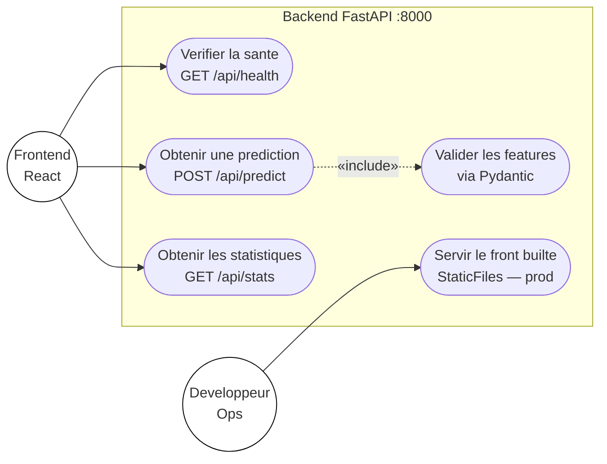
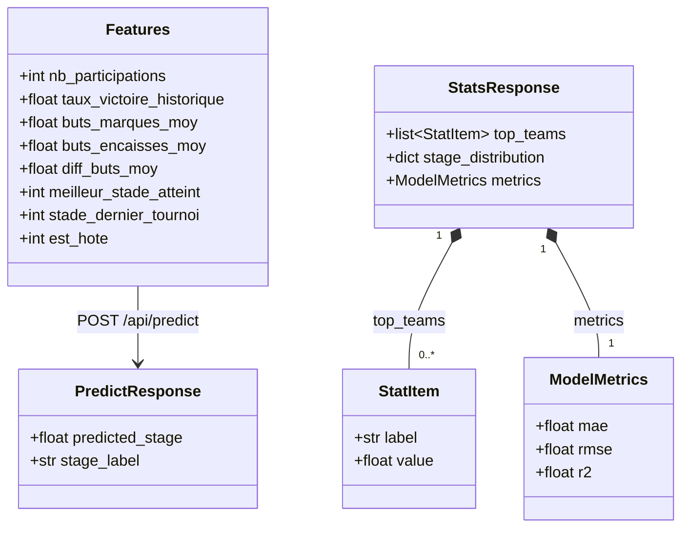
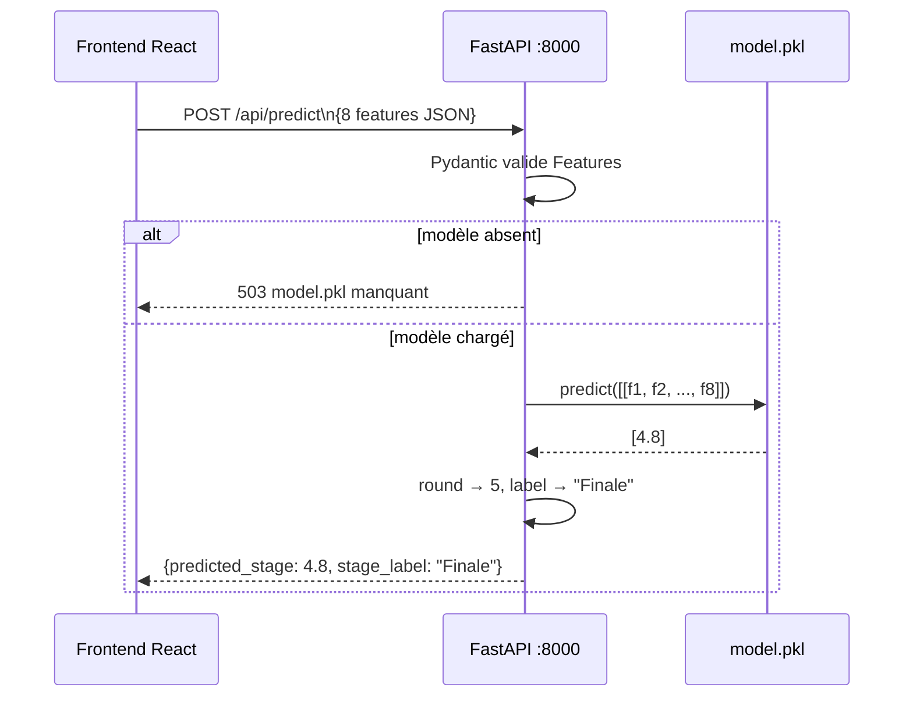

# Spécification — Backend FastAPI

## Responsabilités

- Charger `model.pkl` au démarrage (une seule fois)
- Exposer les endpoints REST consommés par le frontend
- Servir les fichiers statiques du frontend en production

## Endpoints

### `GET /api/health`
Vérification que l'API est opérationnelle.

**Réponse** :
```json
{ "status": "ok" }
```

---

### `POST /api/predict`
Prédit le stade attendu pour une équipe en 2026.

**Corps de la requête** (Pydantic `Features`) :
```json
{
  "nb_participations": 22,
  "taux_victoire_historique": 0.65,
  "buts_marques_moy": 1.8,
  "buts_encaisses_moy": 0.9,
  "diff_buts_moy": 0.9,
  "meilleur_stade_atteint": 6,
  "stade_dernier_tournoi": 4,
  "est_hote": 0
}
```

**Réponse** :
```json
{
  "predicted_stage": 5.2,
  "stage_label": "Finale"
}
```

**Erreur modèle non chargé** : HTTP 503

---

### `GET /api/stats`
Statistiques agrégées pour alimenter les graphiques du dashboard.

**Réponse** (à définir selon les graphiques souhaités) :
```json
{
  "top_teams": [...],
  "stage_distribution": {...},
  "metrics": { "mae": 0.8, "rmse": 1.1 }
}
```

## Structure du fichier `main.py`

```
FastAPI app
├── CORS middleware (origins: localhost:5173)
├── Chargement model.pkl au startup
├── GET  /api/health
├── POST /api/predict
├── GET  /api/stats
└── [StaticFiles — décommenté en production]
```

## Bonnes pratiques

- Une seule instance du modèle en mémoire (variable globale au module)
- Validation automatique des entrées via Pydantic — pas de validation manuelle
- Jamais de ré-entraînement en production
- Les types Pydantic doivent correspondre exactement aux types numpy attendus par sklearn

## Lancer le backend

```bash
# Depuis CodeBase/backend/
python -m venv .venv
.venv\Scripts\activate          # Windows
pip install -r requirements.txt
python main.py                  # http://localhost:8000
```

---

## Diagramme de cas d'utilisation — API (UML)



## Diagramme de classes UML — Modèles Pydantic



## Séquence d'une prédiction


