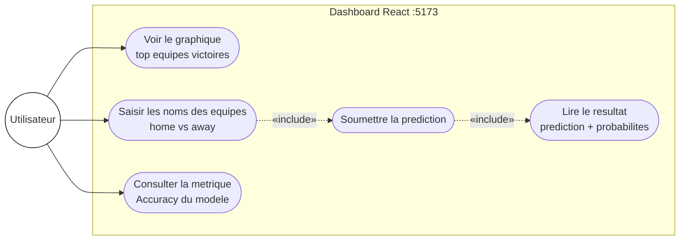
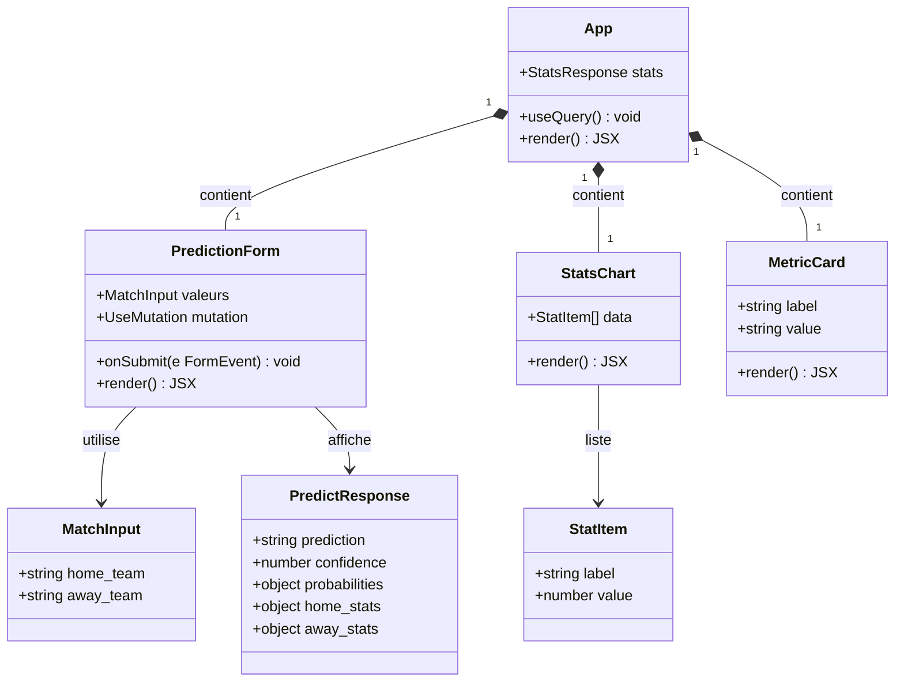
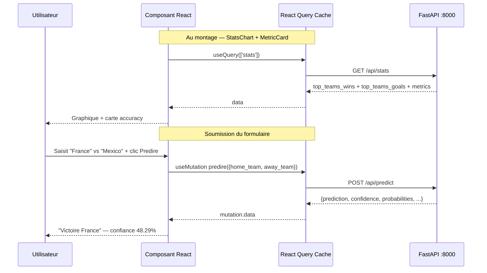

# Spécification — Frontend React

## Stack technique

| Outil | Rôle |
|-------|------|
| React 18 | UI library |
| Vite | Build tool (HMR rapide en dev) |
| TypeScript | Typage statique |
| React Query (`@tanstack/react-query`) | Cache et synchronisation des données serveur |
| shadcn/ui | Composants UI accessibles |
| Recharts | Graphiques (toujours dans `<ResponsiveContainer>`) |

## Sections du dashboard (`App.tsx`)

### 1. Stats historiques
- Graphique : top 10 équipes par pourcentage de victoires (`top_teams_wins`)
- Source : `GET /api/stats`
- Composant Recharts dans `<ResponsiveContainer width="100%" height={300}>`
- Axe X : nom équipe, Axe Y : pourcentage de victoires

### 2. Formulaire de prédiction
- **2 champs texte** : `home_team` et `away_team` (noms d'équipes)
- Mutation React Query → `POST /api/predict`
- Affiche le résultat : prédiction (ex. "Victoire France"), confiance + probabilités home/draw/away

### 3. Performance du modèle
- Affiche l'**accuracy** du modèle (64.80 %) sur le test set
- Source : `GET /api/stats` → `metrics.accuracy`

## Règles d'architecture frontend

- **Tous les appels API dans `src/api.ts`** — jamais de `fetch` dans un composant
- **Données serveur → `useQuery` / `useMutation`** (React Query)
- **État local (UI) → `useState`**
- **Pas de state global** (Redux, Zustand, Context API pour les données)
- Import alias : `@/` pointe sur `src/`
- Ajouter des composants shadcn : `npx shadcn@latest add <composant>`

## Gestion des erreurs courantes

| Symptôme | Cause probable | Solution |
|----------|---------------|----------|
| Graphique blanc | `<ResponsiveContainer>` manquant ou `/api/stats` vide | Wrapper + vérifier la réponse API |
| Erreur CORS | Ports frontend/backend ne correspondent pas | Vérifier que le backend écoute sur 8000 et le frontend sur 5173 |
| TypeScript error sur la réponse | Type `MatchInput` ou `PredictResponse` désynchronisé | Aligner `src/api.ts` avec le modèle Pydantic du backend |
| "Équipe inconnue" | Nom d'équipe pas dans les 84 équipes connues | Afficher un message "stats non disponibles" sans planter |

## Commandes

```bash
# Depuis CodeBase/frontend/
npm install
npm run dev          # http://localhost:5173
npm run typecheck    # vérifier les types sans builder
npm run build        # production → dist/
```

---

## Diagramme de cas d'utilisation — Frontend (UML)



## Diagramme de classes UML — Composants React



## Séquence des interactions (UML)


