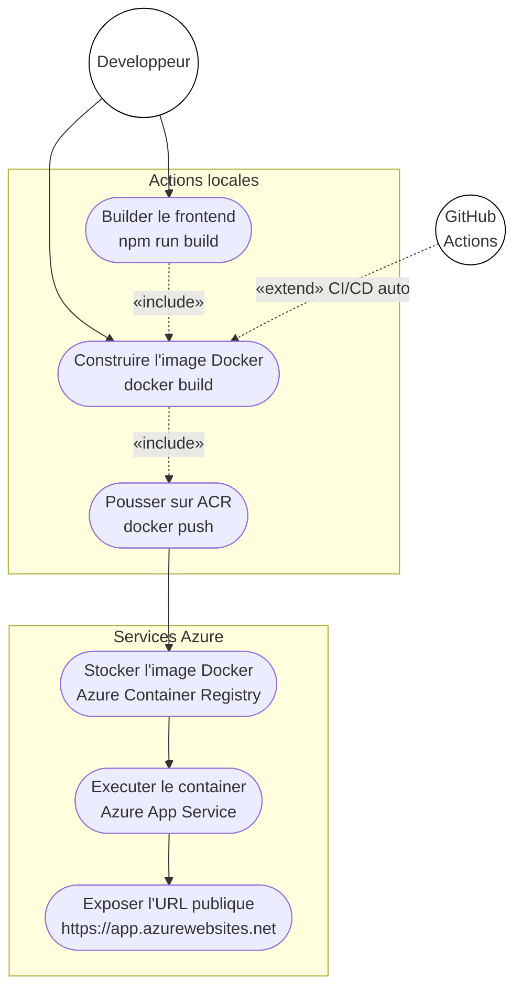
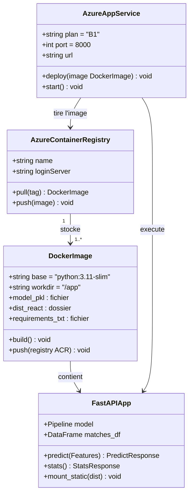

# Spécification — Déploiement Azure (futur)

> **Statut** : hors scope du projet actuel — à traiter après validation du fonctionnement local.

## Objectif

Déployer l'application complète (backend FastAPI + frontend buildé + modèle `model.pkl`) sur Azure.

## Approche recommandée : Azure App Service

1. **Builder le frontend** : `npm run build` → génère `dist/`
2. **Activer les StaticFiles** dans `backend/main.py` (bloc commenté) pour servir `dist/`
3. **Conteneriser** avec Docker (un seul container FastAPI + statiques)
4. **Pousser sur Azure Container Registry (ACR)**
5. **Déployer sur Azure App Service** (plan B1 minimum pour ML)

## Artefacts à préparer

- `Dockerfile` à la racine de `CodeBase/backend/`
- `model.pkl` inclus dans l'image Docker (ou stocké sur Azure Blob Storage)
- Variables d'environnement : ports, CORS origin en production

## Points d'attention

- `model.pkl` contient des objets sklearn sérialisés — ne pas changer la version de scikit-learn entre entraînement et déploiement
- Taille de l'image : les modèles sklearn sont légers, pas de problème
- Coût Azure : App Service B1 ~13 €/mois ; Free tier (F1) possible mais limité en RAM

## Ordre des étapes (quand le moment viendra)

1. Valider que `npm run build` + StaticFiles fonctionne en local
2. Écrire le `Dockerfile`
3. Tester l'image Docker en local (`docker build` + `docker run`)
4. Créer un Azure Container Registry
5. Créer un Azure App Service
6. Configurer le CI/CD (GitHub Actions) pour déploiement automatique

---

## Diagramme de cas d'utilisation — Déploiement (UML)

## Diagramme de classes UML — Infrastructure Docker

