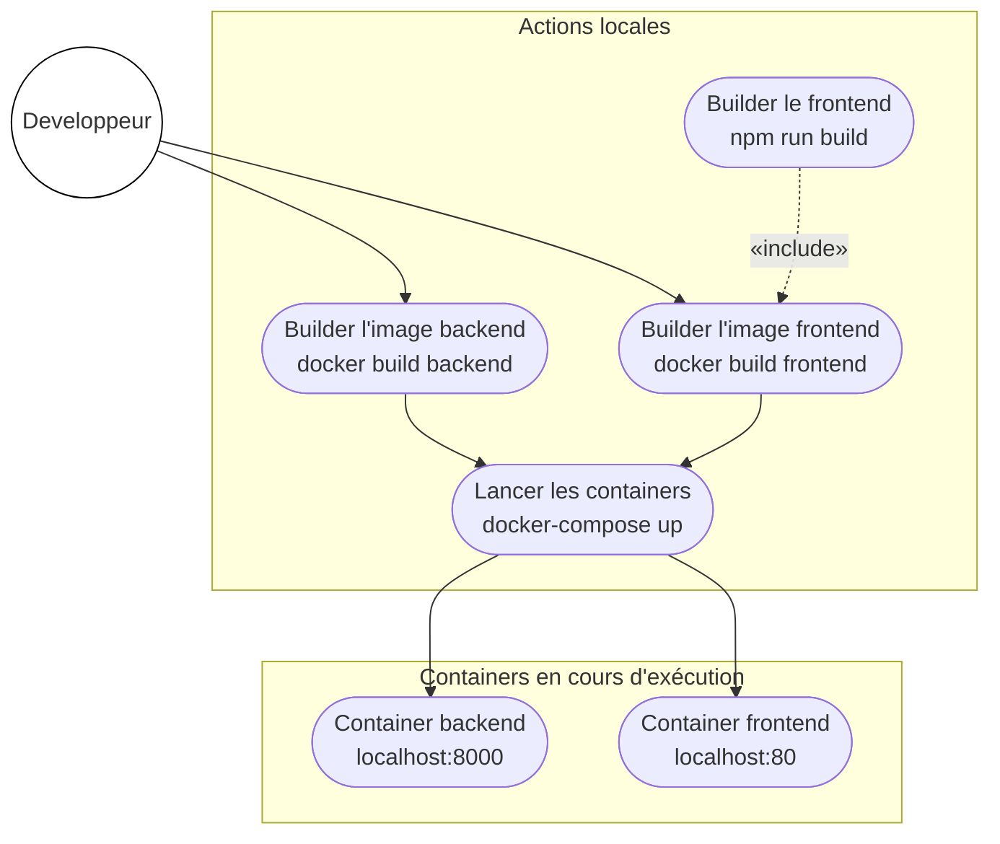
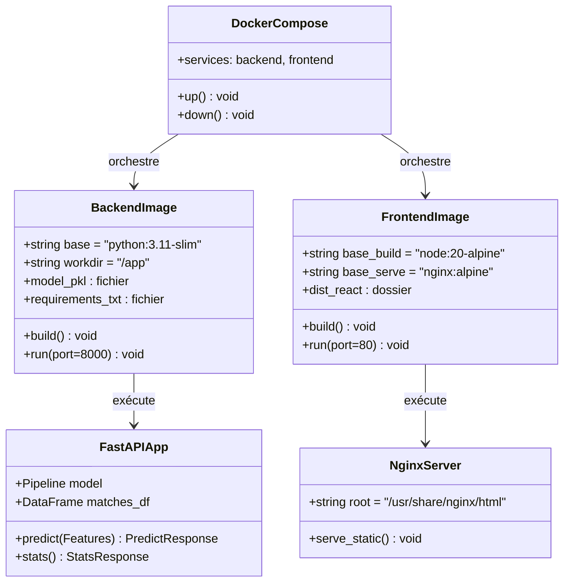

# Spécification — Déploiement Docker

> **Statut** : hors scope du projet actuel — à traiter après validation du fonctionnement local.

## Objectif

Déployer l'application en deux containers Docker indépendants : un pour le backend FastAPI et un pour le frontend React (servi par Nginx).

## Architecture cible

```
docker-compose up
      │
      ├── service: backend  (port 8000)
      │     └── Python 3.11-slim  +  FastAPI  +  model.pkl
      │
      └── service: frontend (port 80)
            └── Nginx  +  React build (dist/)
```

Le navigateur appelle directement `http://localhost:8000/api/...` depuis le frontend servi sur `http://localhost:80`.

## Artefacts à créer

| Fichier | Description |
|---------|-------------|
| `CodeBase/backend/Dockerfile` | Image Python — installe deps, copie `model.pkl`, lance `main.py` |
| `CodeBase/frontend/Dockerfile` | Build multi-stage : `node` build → `nginx` serve |
| `CodeBase/docker-compose.yml` | Orchestre les deux services |

## Contenu des fichiers

### `CodeBase/backend/Dockerfile`

```dockerfile
FROM python:3.11-slim
WORKDIR /app
COPY requirements.txt .
RUN pip install --no-cache-dir -r requirements.txt
COPY . .
EXPOSE 8000
CMD ["python", "main.py"]
```

### `CodeBase/frontend/Dockerfile`

```dockerfile
FROM node:20-alpine AS build
WORKDIR /app
COPY package*.json ./
RUN npm install
COPY . .
RUN npm run build

FROM nginx:alpine
COPY --from=build /app/dist /usr/share/nginx/html
EXPOSE 80
CMD ["nginx", "-g", "daemon off;"]
```

### `CodeBase/docker-compose.yml`

```yaml
services:
  backend:
    build: ./backend
    ports:
      - "8000:8000"

  frontend:
    build: ./frontend
    ports:
      - "80:80"
    depends_on:
      - backend
```

## Points d'attention

- `model.pkl` doit être présent dans `CodeBase/backend/` avant le `docker build`
- CORS dans `main.py` : ajouter `http://localhost` (port 80) aux origines autorisées
- La version de scikit-learn dans `requirements.txt` doit correspondre à celle utilisée pour entraîner le modèle
- `model.pkl` est copié dans l'image — ne pas le versionner s'il est lourd

## Commandes de déploiement local

```bash
# Depuis CodeBase/
docker-compose up --build        # build + démarrage
docker-compose up -d             # mode détaché (relance)
docker-compose down              # arrêt
```

URLs :
- Frontend : `http://localhost`
- Backend API : `http://localhost:8000`
- Health check : `http://localhost:8000/api/health`

## Ordre des étapes

1. Valider que l'app fonctionne en local (sans Docker)
2. Écrire `backend/Dockerfile` et tester : `docker build -t wc-backend . && docker run -p 8000:8000 wc-backend`
3. Écrire `frontend/Dockerfile` et tester : `docker build -t wc-frontend . && docker run -p 80:80 wc-frontend`
4. Écrire `docker-compose.yml` et tester : `docker-compose up --build`
5. Vérifier `GET /api/health` et le dashboard dans le navigateur

---

## Diagramme de cas d'utilisation — Déploiement (UML)



## Diagramme de classes UML — Infrastructure Docker


