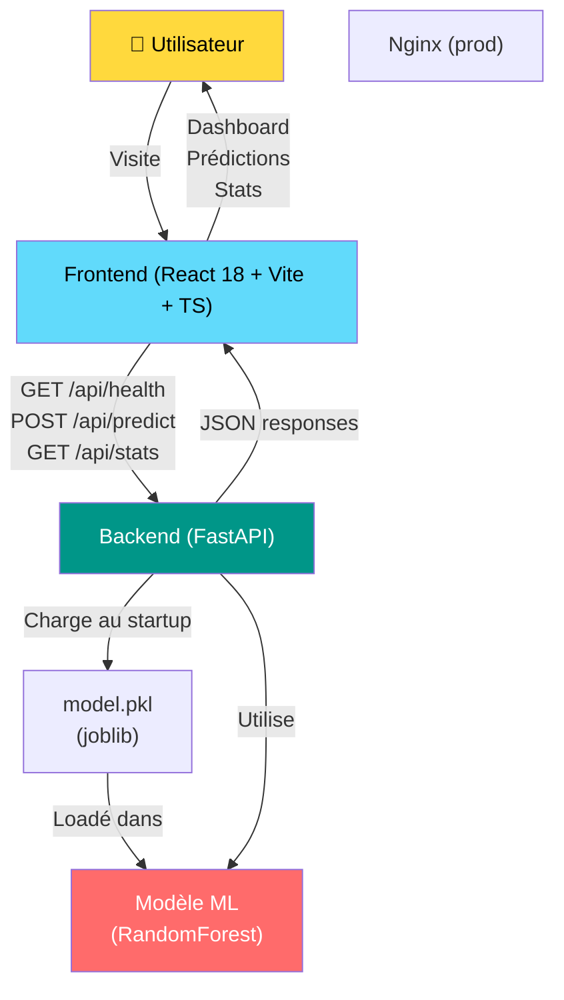

# Architecture Globale

## Vue d'ensemble

La FIFA World Cup 2026 prediction dashboard est une **application fullstack monorepo** combinant :
- **Frontend SPA** : React 18 + Vite + TypeScript, communicant avec l'API via React Query
- **Backend API** : FastAPI (Python) exposant `/api/predict` et `/api/stats`, chargeant un modèle ML via joblib
- **Modèle ML** : RandomForestClassifier pré-entraîné (exporié en `model.pkl` depuis un notebook Jupyter), jamais réentraîné à l'exécution

Le monorepo permet une **livraison unifiée** (Docker) tout en gardant frontend et backend indépendants et testables. Le modèle réside en backend, qui gère la construction des features et l'inférence — le client ne fait que soumettre des équipes et afficher les résultats.

## Schéma d'architecture

## Stack détaillée

| Couche | Technologie | Rôle |
|--------|-------------|------|
| Frontend | React 18 + Vite + TypeScript | SPA interactive, dashboards, formulaires |
| Requêtes | React Query (TanStack Query) | State management serveur, caching, retry |
| Styling | Tailwind CSS + shadcn/ui | Design system cohérent |
| Graphiques | Recharts | Visualisation des statistiques |
| Backend | FastAPI | API REST rapide, typage Pydantic |
| ML Runtime | joblib + sklearn | Chargement et inférence du modèle |
| Déploiement | Docker + docker-compose | Orchestration frontend/backend |
| Données | CSV (GitHub) | Historique Coupes du Monde 1930–2022 |

## Flux principal : prédiction d'un match

1. **User Input** : l'utilisateur saisit 2 équipes (home_team, away_team) dans le formulaire Frontend
2. **POST /api/predict** : le Frontend envoie `{home_team, away_team}` en JSON
3. **Feature Engineering** : le Backend cherche les stats historiques (goal_diff, avg_goals, wins, etc.) pour chaque équipe
4. **Inférence** : RandomForestClassifier prédit la classe (0=home win, 1=draw, 2=away win) + probabilités
5. **Réponse** : Backend retourne `{prediction, confidence, probabilities, home_stats, away_stats}`
6. **Affichage** : Frontend affiche le résultat avec clarté (badge + probabilités)

## Pourquoi ce design ?

- **Monorepo** : une seule déploiement Docker, version cohérente frontend/backend, tests e2e simplifiés
- **React + FastAPI** : combinaison industrielle éprouvée — React pour l'UI réactive, FastAPI pour l'API stable et bien documentée
- **Modèle pré-entraîné** : pas de latence de training à l'exécution, reproductibilité garantie (même inférence partout)
- **React Query** : gère le cache, les retry, et les states de loading — moins de code, moins de bugs

