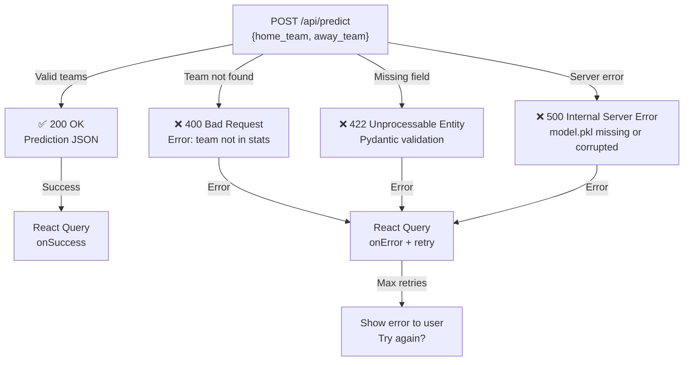

# Diagramme de Séquence : Flux Technique de Prédiction

## Vue d'ensemble

Quand l'utilisateur clique "Prédire" avec 2 équipes, voici **exactement** ce qu'il se passe entre le frontend, le backend et le modèle ML.

---

## Séquence détaillée : POST /api/predict

```mermaid
sequenceDiagram
    participant Browser as 🖥️ Browser<br/>(Frontend React)
    participant ReactQuery as ⚡ React Query<br/>(useMutation)
    participant Fetch as 📡 HTTP Client<br/>(fetch)
    participant FastAPI as 🔌 FastAPI Server
    participant ModelPkl as 💾 model.pkl<br/>(joblib)
    participant RandomForest as 🤖 RandomForest<br/>Classifier
    participant Response as ↩️ Response
    
    Note over Browser,Response: 1️⃣ USER CLICKS "PREDICT"
    Browser->>ReactQuery: useMutation.mutate()<br/>({home_team, away_team})
    ReactQuery->>ReactQuery: Set isLoading=true
    ReactQuery-->>Browser: Render spinner
    
    Note over Browser,Response: 2️⃣ PREPARE & SEND REQUEST
    ReactQuery->>Fetch: POST /api/predict
    Fetch->>Fetch: Build JSON payload:<br/>{home_team: "France",<br/>away_team: "Mexico"}
    Fetch->>Fetch: Add headers:<br/>Content-Type: application/json
    Fetch->>FastAPI: HTTP POST 🚀
    
    Note over Browser,Response: 3️⃣ BACKEND RECEIVES REQUEST
    FastAPI->>FastAPI: Route: POST /api/predict
    FastAPI->>FastAPI: Parse request body<br/>→ Pydantic validation
    FastAPI->>FastAPI: Extract:<br/>home_team = "France"<br/>away_team = "Mexico"
    
    Note over Browser,Response: 4️⃣ FEATURE ENGINEERING
    FastAPI->>FastAPI: Lookup home_stats["France"]:<br/>• home_avg_goals = 1.85<br/>• total_matches = 45<br/>• wins = 15
    FastAPI->>FastAPI: Lookup away_stats["Mexico"]:<br/>• away_avg_goals = 1.42<br/>• total_matches = 42<br/>• wins = 12
    FastAPI->>FastAPI: Compute features:<br/>• goal_diff = 0.35<br/>• year = 2026<br/>• count_teams = 32
    
    Note over Browser,Response: 5️⃣ BUILD FEATURE VECTOR
    FastAPI->>FastAPI: X = [<br/>&nbsp;1.85 (home_avg_goals),<br/>&nbsp;1.42 (away_avg_goals),<br/>&nbsp;0.35 (goal_diff),<br/>&nbsp;45 (home_total_matches),<br/>&nbsp;42 (away_total_matches),<br/>&nbsp;15 (home_wins),<br/>&nbsp;12 (away_wins),<br/>&nbsp;2026 (year),<br/>&nbsp;32 (count_teams)<br/>]
    
    Note over Browser,Response: 6️⃣ LOAD & INFERENCE
    FastAPI->>ModelPkl: (Already loaded at startup)<br/>model, stats_bundle = joblib.load()
    ModelPkl-->>RandomForest: Model + scalers ready
    FastAPI->>RandomForest: model.predict_proba(X)
    RandomForest->>RandomForest: 100 DecisionTrees vote
    RandomForest->>RandomForest: Aggregate probabilities:<br/>P(home win) = 0.62<br/>P(draw) = 0.18<br/>P(away win) = 0.20
    RandomForest-->>FastAPI: probabilities = [0.62, 0.18, 0.20]<br/>predicted_class = 0 (home win)
    
    Note over Browser,Response: 7️⃣ BUILD RESPONSE JSON
    FastAPI->>Response: Assemble:<br/>{<br/>&nbsp;"prediction": 0,<br/>&nbsp;"predicted_label": "Home Win",<br/>&nbsp;"confidence": 0.62,<br/>&nbsp;"probabilities": {<br/>&nbsp;&nbsp;"home_win": 0.62,<br/>&nbsp;&nbsp;"draw": 0.18,<br/>&nbsp;&nbsp;"away_win": 0.20<br/>&nbsp;},<br/>&nbsp;"home_stats": {<br/>&nbsp;&nbsp;"team": "France",<br/>&nbsp;&nbsp;"avg_goals": 1.85,<br/>&nbsp;&nbsp;"wins": 15<br/>&nbsp;},<br/>&nbsp;"away_stats": {<br/>&nbsp;&nbsp;"team": "Mexico",<br/>&nbsp;&nbsp;"avg_goals": 1.42,<br/>&nbsp;&nbsp;"wins": 12<br/>&nbsp;}<br/>}
    Response->>Fetch: HTTP 200 OK
    Fetch-->>ReactQuery: Response JSON
    
    Note over Browser,Response: 8️⃣ FRONTEND CONSUMES RESULT
    ReactQuery->>ReactQuery: onSuccess callback
    ReactQuery->>ReactQuery: data = response payload
    ReactQuery->>ReactQuery: Set isLoading=false
    ReactQuery-->>Browser: Trigger re-render
    Browser->>Browser: Render prediction badge:<br/>🏠 France favori (62%)
    Browser->>Browser: Render probability bars<br/>(Recharts)
    Browser->>Browser: Render stats cards
    Browser-->>Browser: ✅ Display to user
```

---

## Timeline (latence)

| Phase | Durée | Composant |
|-------|-------|-----------|
| 1. Mutation trigger | <1ms | React Query |
| 2. Network round-trip (Paris→Strasbourg) | ~50ms | HTTP |
| 3. Backend parse + validate | ~5ms | Pydantic |
| 4. Feature lookup (dict) | ~1ms | Python dict |
| 5. Feature compute | ~2ms | NumPy |
| 6. Model inference | ~50ms | RandomForest (100 trees) |
| 7. Response serialize | ~1ms | JSON |
| 8. Frontend render | ~10ms | React |
| **Total** | ~**120ms** (acceptable) | |

---

## Codes HTTP et erreurs



---

## Constantes hardcodées (important)

```python
# backend/main.py
NUM_FEATURES = 9
FEATURE_ORDER = [
    'home_avg_goals',      # 0
    'away_avg_goals',      # 1
    'goal_diff',           # 2
    'home_total_matches',  # 3
    'away_total_matches',  # 4
    'home_wins',           # 5
    'away_wins',           # 6
    'year',                # 7
    'count_teams'          # 8
]
PREDICTION_CLASSES = {
    0: "Home Win",
    1: "Draw",
    2: "Away Win"
}
```

---

## Optimisations appliquées

✅ **Model pré-chargé au startup** → pas de latence à la 1ère requête  
✅ **Stats en mémoire (dict)** → lookup O(1) au lieu de DB query  
✅ **React Query caching** → requêtes /api/stats réutilisées  
✅ **No batch predictions** → une prédiction = une requête (scalable)  

---

## Points critiques de débogage

| Symptôme | Cause probable | Solution |
|----------|---|---|
| 404 /api/predict | Route non définie | Vérifier `@app.post("/api/predict")` |
| 422 Validation Error | Champ manquant/mal nommé | Vérifier `{home_team, away_team}` |
| Team not found (400) | Équipe pas en database | Vérifier `home_stats.keys()` |
| model.pkl not found | Fichier manquant | Générer via ETL notebook |
| NaN in features | Équipe nouvelle, stats vides | Gérer cas limite (défaut à 0) |
| Slow response (>500ms) | Model trop complex ou serveur surchargé | Profiler RandomForest.predict_proba |

