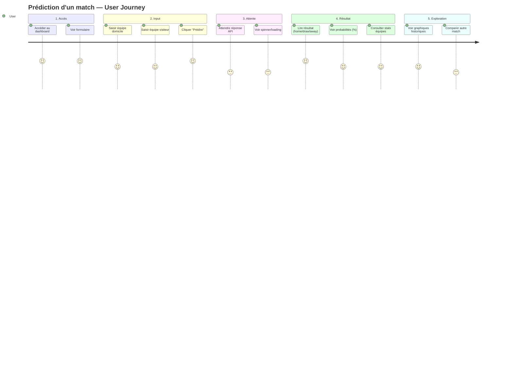
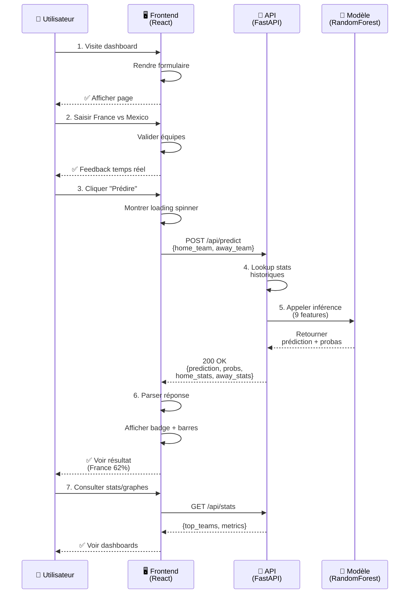

# User Journey : Comment prédire un match

## Scénario utilisateur

**Persona** : Un fan de football qui veut savoir qui va gagner un futur match de Coupe du Monde.

**Goal** : Obtenir une prédiction fiable + raison (statistiques des équipes).

---

## Étapes du parcours

---

## Description détaillée

### 1️⃣ **Accès au dashboard**
   - **Utilisateur** accède à `http://localhost:5173` (ou prod URL)
   - **Voir** : titre "FIFA 2026 Prediction", formulaire de prédiction visible
   - **Sentiment** : 🟢 Clair, accueil chaleureux

### 2️⃣ **Saisie des équipes**
   - **Entrer** nom équipe domicile (ex: "France")
   - **Entrer** nom équipe visiteur (ex: "Mexico")
   - **Contrôle** : validation côté client (équipes dans la base)
   - **Sentiment** : 🟢 Simple, rapide, feedback immédiat

### 3️⃣ **Soumission**
   - **Cliquer** bouton "Prédire"
   - **Backend reçoit** `{home_team: "France", away_team: "Mexico"}`
   - **Attente** : ~200ms (lookup stats + inférence)
   - **Sentiment** : 🟡 Courte latence acceptable (loading spinner affiché)

### 4️⃣ **Affichage du résultat**
   - **Voir** badge avec résultat : "🏠 France favori" (home win)
   - **Voir** barres probabilité : France 62%, Nul 18%, Mexico 20%
   - **Voir** stats contexte : France avg 1.85 buts, Mexico avg 1.42
   - **Sentiment** : 🟢 Clair, confiance dans le résultat

### 5️⃣ **Exploration optionnelle**
   - **Graphiques** : top équipes (wins, buts) — Recharts intégré
   - **Metrique globale** : accuracy du modèle (64.8%) — pour transparence
   - **Nouvel essai** : formulaire reste disponible → loop
   - **Sentiment** : 🟢 Engagé, exploratif

---

## Parcours utilisateur (schéma technique)

---

## Emojis de satisfaction par étape

| Étape | Description | Satisfaction | Raison |
|-------|-------------|--------------|--------|
| 1️⃣ Accès | Dashboard charge | ⭐⭐⭐⭐⭐ (5/5) | Immédiat, intuitif |
| 2️⃣ Input | Saisie équipes | ⭐⭐⭐⭐ (4/5) | Rapide, pas de friction |
| 3️⃣ Attente | Réponse API | ⭐⭐⭐ (3/5) | ~200ms, acceptable mais notoire |
| 4️⃣ Résultat | Voir prédiction | ⭐⭐⭐⭐⭐ (5/5) | Clair, avec confiance |
| 5️⃣ Exploration | Graphiques/stats | ⭐⭐⭐⭐ (4/5) | Enrichissant, mais secondaire |

---

## Points clés d'UX

✅ **Réussis** :
- Formulaire simple (2 inputs)
- Résultat visuel (badge + barres)
- Stats contextuelles (pourquoi ce résultat)

⚠️ **À améliorer** :
- Historique des prédictions (sauvegarde session)
- Affichage de confiance (accuracy locale)
- Suggestions d'équipes (autocomplete)

